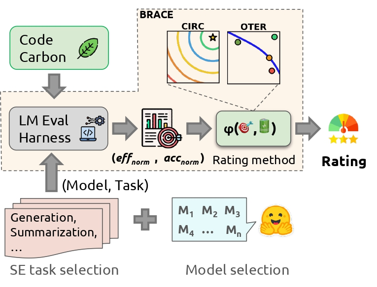

# BRACE: Unified Benchmarking of Accuracy, Energy, and Size for Code Language Models

## Overview
**[Pre-print: https://arxiv.org/abs/2511.07698](https://arxiv.org/abs/2511.07698)**

This repository is the replication package for **BRACE**, a framework that benchmarks Code Language Models (*CLMs*) jointly on **energy efficiency**, **functional correctness (accuracy)**, and **model size**, and reports each on a unified **1–5** scale. Instead of collapsing these competing dimensions into a single opaque score, BRACE decouples the evaluation into three interpretable **pairwise profiles** — energy–accuracy, size–accuracy, and size–energy.

We benchmark **33** state-of-the-art open-source *CLMs* on two software-engineering tasks — code generation ([LiveCodeBench](https://livecodebench.github.io/)) and code summarization ([CodeXGLUE](https://github.com/microsoft/CodeXGLUE)). Energy is measured locally with [CodeGreen](https://github.com/SMART-Dal/CodeGreen); accuracy and generation run on top of the [LM-Evaluation-Harness](https://github.com/EleutherAI/lm-evaluation-harness).



<br></br>

> **Abstract**: The rapid adoption of AI in software development calls for evaluating the environmental cost of code models alongside their functional correctness. While prior studies have examined sustainability in large language models, they lack a systematic and interpretable framework for jointly evaluating the accuracy, energy, and size trade-offs of Code Language Models (*CLMs*). We present **BRACE**, a framework that benchmarks *CLMs* across energy efficiency, functional correctness, and model size, and reports them on a unified 1–5 scale. Rather than collapsing these competing dimensions into a single opaque score, BRACE decouples the evaluation into three interpretable pairwise profiles. For the energy–accuracy trade-off, we propose two rating methods: **Concentric Incremental Rating Circles (CIRC)** provides deterministic, distance-based rankings with static trade-offs that resist outliers, and **Observation to Expectation Rating (OTER)** provides trend-aware evaluation with dynamic trade-offs that capture the complex correlation between energy and accuracy. We extend both methods with priority weighting so users can tune the relative importance of accuracy and energy. To account for deployment scale, we further introduce scaling-law-based **Performance Efficiency** and **Structural Efficiency** metrics that assess how effectively a model converts its size into accuracy and into energy savings. Benchmarking 33 *CLMs*, we find that models generally perform better on summarization, and that small model size does not by itself secure efficiency — what separates models is how densely they convert parameters into capability, not raw scale.

### Research Questions

- **RQ1 — Energy–Accuracy rating.** Rate CLMs on their energy–accuracy trade-off with a unified method (CIRC, OTER). *(22-model base cohort.)*
- **RQ2 — Rating distribution shift.** Grow the cohort from 22 → 33 models and verify that ratings/ordering stay stable and justified.
- **RQ3 — Priority elasticity.** Sweep accuracy/energy weights (`w_a`, `w_e`) and verify the weighted CIRC/OTER stay monotonic, continuous, and interpretable.
- **RQ4 — Scaling-law efficiencies.** Rate how efficiently each model turns its size into accuracy (Performance Efficiency, ψ) and energy savings (Structural Efficiency, τ).

---

## Repository Map

High-level map of the most relevant parts of the repo.

```
├── lm_eval
│   ├── main_run.py              # entry point: run models on benchmarks + energy profiling
│   ├── run_config.yaml          # models/tasks/quantization to run
│   ├── configs.py               # paths & defaults (default output: results/results.jsonl)
│   ├── models/huggingface.py    # HF model backend
│   ├── tasks/
│   │   ├── LiveCodeBench/        # code generation (pass@1)
│   │   └── code_x_glue/          # code summarization (smoothed BLEU)
│   ├── results/                 # result files (see "Result files" below)
│   └── rating_llms/             # the BRACE rating methods
│       ├── methods/             # circ, oter, size_acc, size_ene
│       ├── validation/          # statistical validation suites (RQ1–RQ4)
│       └── utils/
└── RQ_experiments               # scripts that reproduce the paper's tables/figures
    ├── RQ1/  RQ2/  RQ3/  RQ4/    # generate_*.py / analyze_*.py -> report/
    └── Motivation/
```

### Result files (`lm_eval/results/`)

| File | Contents | Used for |
|------|----------|----------|
| `partial_results_codegreen_.jsonl` | 22 base models × 2 tasks | **RQ1** |
| `final_results_codegreen.jsonl`    | 33 models × 2 tasks       | **RQ2, RQ3, RQ4** |
| `results.jsonl`                    | raw run log (repeated runs, many models) | default `main_run.py` sink |

> **Note.** Each curated file holds **one aggregated row per model per task**. The raw `results.jsonl` contains **repeated runs** of each model; the rating scripts do **not** deduplicate or average, so point them at the curated `*_codegreen*.jsonl` files (or aggregate `results.jsonl` first) to reproduce the paper.

---

## Install
```bash
git clone git@github.com:SMART-Dal/LLM-Sustainability-Rater.git
cd LLM-Sustainability-Rater
python3 -m venv venv
source venv/bin/activate
pip install --no-cache-dir -e .
```

### Replication notes (pinning)

To reproduce the **accuracy** numbers in `lm_eval/results/`, pin the generation stack after the editable install:

1. **Two models need a one-line `tokenizer_config.json` patch under transformers 4.55.0.** They ship `"extra_special_tokens"` as a list, but 4.55.0 expects a dict (fixed in 5.x). Affected: `ryzdfm/qwen2.5-coder-3b-claude_opus_4.6-distilled`, `dcostenco/prism-coder-7b`. After the model downloads, edit `~/.cache/huggingface/hub/models--<owner>--<name>/snapshots/<rev>/tokenizer_config.json` and set `"extra_special_tokens"` to `{}`. This is functionally neutral for these benchmarks (the tokens remain in `tokenizer.json`/`special_tokens_map.json`; only the named-attribute accessors are dropped, which the pipeline does not use).

---

## Usage

### 0. Environment
Create a `.env` file with your HuggingFace token (used to look up model sizes for RQ4):
```
HF_TOKEN=YOUR_TOKEN
```

### 1. Run models & measure energy + accuracy (`main_run.py`)
```bash
cd lm_eval
# edit run_config.yaml first (see below), then:
python main_run.py
```
Configure `run_config.yaml`:
- `model`: `hf` (run base HF models without optimizations).
- `tasks`: benchmark task names (`lm-eval --tasks list`); this study uses `livecodebench` and `code2text_python`.
- `model_args`: any argument `AutoModel.from_pretrained` accepts.
- `bnb_config`: per-model bitsandbytes quantization (index-aligned with `model_args`); e.g. `load_in_4bit=True`.
- `experiments_run`: a tag stored in the results for later filtering.

Each model runs **sequentially**, one task at a time. Results append to `results/results.jsonl`; per-model energy logs land in `codegreen_log/{task_name}/{model_name}/{stage}.log`.

### 2. Energy–Accuracy rating — CIRC & OTER (RQ1–RQ3)
Run from the **repo root**:
```bash
# CIRC (deterministic, distance-based)
python -m lm_eval.rating_llms.methods.circ \
    --task_name livecodebench \
    --file_name lm_eval/results/partial_results_codegreen_.jsonl

# OTER (trend-aware)
python -m lm_eval.rating_llms.methods.oter \
    --task_name code2text_python \
    --file_name lm_eval/results/partial_results_codegreen_.jsonl
```
Flags:
- `--task_name` (required): `livecodebench` or `code2text_python`.
- `--file_name` (default `lm_eval/results/results.jsonl`): the `.jsonl` result file.
- `--w_a` / `--w_e` (optional): accuracy / energy priority weights, must sum to 1 (default `0.5`/`0.5`). Passing one infers the other. `w_e=1` → pure energy, `w_e=0` → pure accuracy.

**Output** → `lm_eval/rating_llms/data/acc_ene/{METHOD}_{file}_{task}_wa_{wa}_we_{we}/` containing `rating.xlsx` and the rating-region plot (`distance.pdf` for CIRC, `regression.pdf` for OTER).

### 3. Size-efficiency rating — Performance (ψ) & Structural (τ) Efficiency (RQ4)
```bash
# size vs accuracy  (Performance Efficiency, ψ)
python -m lm_eval.rating_llms.methods.size_acc \
    --task_name livecodebench \
    --file_name lm_eval/results/final_results_codegreen.jsonl

# size vs energy    (Structural Efficiency, τ)
python -m lm_eval.rating_llms.methods.size_ene \
    --task_name livecodebench \
    --file_name lm_eval/results/final_results_codegreen.jsonl
```
Model sizes are fetched from HuggingFace (memory footprint in GB) and cached in `lm_eval/rating_llms/data/acc_size/model_sizes_cache.json`.
**Output** → `data/acc_size/{file}_{task}/` and `data/size_ene/{file}_{task}/` (`rating.xlsx` + rating plot).

### 4. Reproduce the paper's tables, figures, and statistics

**Per-RQ tables & figures** (written to each `RQ_experiments/RQ*/report/`):
```bash
python RQ_experiments/RQ1/generate_rq1.py   # Table 1 + rq1_plot_grid.pdf  (22 models)
python RQ_experiments/RQ2/generate_rq2.py   # Table 2 + rq2_plot_grid.pdf  (33 models)
python RQ_experiments/RQ3/generate_rq3.py   # weight-sweep grid, continuity & sensitivity figs
python RQ_experiments/RQ3/analyze_rq3.py    # rq3_analysis.txt (weighted-rating validation)
python RQ_experiments/RQ4/generate_rq4.py   # Table 3 + size-acc / size-ene plots
python RQ_experiments/RQ4/analyze_rq4.py    # rq4_analysis.txt (in-depth size analysis)
```

**Statistical validation suites** (from the repo root):
```bash
python -m lm_eval.rating_llms.validation.validation_base      # RQ1: Kruskal-Wallis size-bias, LOO, noise, OTER hyperparam & outlier sensitivity
python -m lm_eval.rating_llms.validation.rating_stability     # RQ2: ordering stability & rating shifts (needs RQ1+RQ2 tables generated first)
python -m lm_eval.rating_llms.validation.validation_scaling   # RQ4: orthogonality, LOO, noise, size-regime extrapolation
# RQ3 weighted-rating validation is invoked by RQ_experiments/RQ3/analyze_rq3.py
```

---

## Results

### RQ1 — Energy–Accuracy ratings (22 base models)
Normalized accuracy (`A`) and energy efficiency (`E`), with CIRC/OTER ratings per benchmark (LCB = LiveCodeBench, CXG = CodeXGLUE). These are regenerated by `RQ_experiments/RQ1/generate_rq1.py`.

| ID  | Model | LCB A | LCB E | CXG A | CXG E | LCB CIRC | LCB OTER | CXG CIRC | CXG OTER |
|-----|-------|:-----:|:-----:|:-----:|:-----:|:--------:|:--------:|:--------:|:--------:|
| M1  | deepseek-coder-6.7b-base        | 0.23 | 0.31 | 0.47 | 0.23 | 2 | 1 | 2 | 3 |
| M2  | starcoderbase-1b                | 0.00 | 0.93 | 0.00 | 0.88 | 2 | 1 | 2 | 1 |
| M3  | starcoder2-3b                   | 0.02 | 0.23 | 0.37 | 0.32 | 1 | 1 | 2 | 3 |
| M4  | CodeLlama-7b-Instruct-hf        | 0.21 | 0.82 | 0.76 | 0.23 | 3 | 1 | 3 | 4 |
| M5  | Qwen2.5-Coder-3B-Instruct       | 0.52 | 0.95 | 0.36 | 0.57 | 4 | 3 | 3 | 3 |
| M6  | Qwen2.5-Coder-7B-Instruct       | 0.38 | 0.78 | 0.36 | 0.76 | 3 | 2 | 3 | 3 |
| M7  | Qwen2.5-Coder-1.5B              | 0.48 | 0.99 | 0.31 | 0.88 | 4 | 3 | 3 | 3 |
| M8  | deepseek-coder-1.3b-base        | 0.10 | 0.76 | 0.70 | 0.79 | 2 | 1 | 4 | 5 |
| M9  | deepseek-coder-7b-instruct-v1.5 | 0.58 | 0.77 | 0.35 | 0.35 | 4 | 3 | 2 | 2 |
| M10 | starcoder2-7b                   | 0.04 | 0.15 | 0.56 | 0.21 | 1 | 1 | 2 | 3 |
| M11 | codegen-350M-mono               | 0.02 | 0.83 | 0.09 | 0.83 | 2 | 1 | 2 | 1 |
| M12 | Qwen2.5-Coder-0.5B              | 0.27 | 0.99 | 0.37 | 0.88 | 3 | 2 | 3 | 3 |
| M13 | Yi-Coder-9B                     | 0.33 | 0.00 | 0.16 | 0.00 | 1 | 1 | 1 | 1 |
| M14 | rombos_Replete-Coder-Llama3-8B  | 0.21 | 0.74 | 0.20 | 0.28 | 3 | 1 | 2 | 2 |
| M15 | speechless-code-mistral-7b-v1.0 | 0.31 | 0.85 | 0.37 | 0.60 | 3 | 2 | 3 | 3 |
| M16 | stable-code-3b                  | 0.06 | 0.68 | 0.53 | 0.67 | 2 | 1 | 3 | 4 |
| M17 | CodeLlama-7b-Python-hf          | 0.15 | 0.73 | 0.38 | 0.23 | 2 | 1 | 2 | 2 |
| M18 | Seed-Coder-8B-Instruct          | 1.00 | 0.88 | 0.31 | 0.59 | 5 | 5 | 3 | 2 |
| M19 | CodeQwen1.5-7B-Chat             | 0.06 | 0.99 | 0.03 | 1.00 | 2 | 1 | 2 | 1 |
| M20 | Magicoder-S-DS-6.7B             | 0.42 | 0.62 | 0.39 | 0.42 | 3 | 2 | 3 | 3 |
| M21 | granite-8b-code-base-4k         | 0.10 | 1.00 | 1.00 | 0.14 | 2 | 1 | 2 | 5 |
| M22 | codegen-2B-mono                 | 0.02 | 0.64 | 0.45 | 0.51 | 2 | 1 | 3 | 3 |

The full **33-model** ratings (RQ2), the **weighted** ratings (RQ3), and the **size-efficiency** ratings ψ/τ (RQ4) are regenerated into `RQ_experiments/RQ2/report/`, `RQ3/report/`, and `RQ4/report/` respectively (`*_table.xlsx`, `*_table.tex`, and `*.pdf` figures).

### Generated artifacts per RQ

| RQ | Command | Key outputs (`RQ_experiments/RQ*/report/`) |
|----|---------|--------------------------------------------|
| RQ1 | `generate_rq1.py` | `rq1_table.{xlsx,tex}`, `rq1_plot_grid.pdf` |
| RQ2 | `generate_rq2.py` | `rq2_table.{xlsx,tex}`, `rq2_plot_grid.pdf` |
| RQ3 | `generate_rq3.py`, `analyze_rq3.py` | `rq3_weight_grid.pdf`, `rq3_continuity.pdf`, `rq3_weight_sensitivity.pdf`, `rq3_weight_ratings.xlsx`, `rq3_analysis.txt` |
| RQ4 | `generate_rq4.py`, `analyze_rq4.py` | `rq4_table.{xlsx,tex}`, `rq4_size_acc_plot.pdf`, `rq4_size_ene_plot.pdf`, `rq4_analysis.txt` |

---

## Experimented Models (33)

<details>
<summary>Click to expand the full list</summary>

- [deepseek-ai/deepseek-coder-6.7b-base](https://huggingface.co/deepseek-ai/deepseek-coder-6.7b-base)
- [bigcode/starcoderbase-1b](https://huggingface.co/bigcode/starcoderbase-1b)
- [bigcode/starcoder2-3b](https://huggingface.co/bigcode/starcoder2-3b)
- [codellama/CodeLlama-7b-Instruct-hf](https://huggingface.co/codellama/CodeLlama-7b-Instruct-hf)
- [Qwen/Qwen2.5-Coder-3B-Instruct](https://huggingface.co/Qwen/Qwen2.5-Coder-3B-Instruct)
- [Qwen/Qwen2.5-Coder-7B-Instruct](https://huggingface.co/Qwen/Qwen2.5-Coder-7B-Instruct)
- [Qwen/Qwen2.5-Coder-1.5B](https://huggingface.co/Qwen/Qwen2.5-Coder-1.5B)
- [deepseek-ai/deepseek-coder-1.3b-base](https://huggingface.co/deepseek-ai/deepseek-coder-1.3b-base)
- [deepseek-ai/deepseek-coder-7b-instruct-v1.5](https://huggingface.co/deepseek-ai/deepseek-coder-7b-instruct-v1.5)
- [bigcode/starcoder2-7b](https://huggingface.co/bigcode/starcoder2-7b)
- [Salesforce/codegen-350M-mono](https://huggingface.co/Salesforce/codegen-350M-mono)
- [Qwen/Qwen2.5-Coder-0.5B](https://huggingface.co/Qwen/Qwen2.5-Coder-0.5B)
- [01-ai/Yi-Coder-9B](https://huggingface.co/01-ai/Yi-Coder-9B)
- [rombodawg/rombos_Replete-Coder-Llama3-8B](https://huggingface.co/rombodawg/rombos_Replete-Coder-Llama3-8B)
- [uukuguy/speechless-code-mistral-7b-v1.0](https://huggingface.co/uukuguy/speechless-code-mistral-7b-v1.0)
- [stabilityai/stable-code-3b](https://huggingface.co/stabilityai/stable-code-3b)
- [codellama/CodeLlama-7b-Python-hf](https://huggingface.co/codellama/CodeLlama-7b-Python-hf)
- [ByteDance-Seed/Seed-Coder-8B-Instruct](https://huggingface.co/ByteDance-Seed/Seed-Coder-8B-Instruct)
- [Qwen/CodeQwen1.5-7B-Chat](https://huggingface.co/Qwen/CodeQwen1.5-7B-Chat)
- [ise-uiuc/Magicoder-S-DS-6.7B](https://huggingface.co/ise-uiuc/Magicoder-S-DS-6.7B)
- [ibm-granite/granite-8b-code-base-4k](https://huggingface.co/ibm-granite/granite-8b-code-base-4k)
- [Salesforce/codegen-2B-mono](https://huggingface.co/Salesforce/codegen-2B-mono)
- [uukuguy/speechless-zephyr-code-functionary-7b](https://huggingface.co/uukuguy/speechless-zephyr-code-functionary-7b)
- [infly/OpenCoder-8B-Instruct](https://huggingface.co/infly/OpenCoder-8B-Instruct)
- [ShahriarFerdoush/llama-3.2-1b-code-instruct](https://huggingface.co/ShahriarFerdoush/llama-3.2-1b-code-instruct)
- [m-a-p/OpenCodeInterpreter-DS-6.7B](https://huggingface.co/m-a-p/OpenCodeInterpreter-DS-6.7B)
- [ricdomolm/mini-coder-1.7b](https://huggingface.co/ricdomolm/mini-coder-1.7b)
- [google/codegemma-2b](https://huggingface.co/google/codegemma-2b)
- [bigatuna/Qwen3-1.7B-Sushi-Coder](https://huggingface.co/bigatuna/Qwen3-1.7B-Sushi-Coder)
- [beowolx/CodeNinja-1.0-OpenChat-7B](https://huggingface.co/beowolx/CodeNinja-1.0-OpenChat-7B)
- [ryzdfm/qwen2.5-coder-3b-claude_opus_4.6-distilled](https://huggingface.co/ryzdfm/qwen2.5-coder-3b-claude_opus_4.6-distilled)
- [google/codegemma-7b-it](https://huggingface.co/google/codegemma-7b-it)
- [dcostenco/prism-coder-7b](https://huggingface.co/dcostenco/prism-coder-7b)

</details>

The first 22 models form the RQ1 base cohort; models 23–33 are the RQ2 extension.

---

#### Credit
- [LM-Evaluation-Harness](https://github.com/EleutherAI/lm-evaluation-harness)
- [CodeGreen](https://github.com/SMART-Dal/CodeGreen)
- [LiveCodeBench](https://github.com/EleutherAI/lm-evaluation-harness/pull/3078)